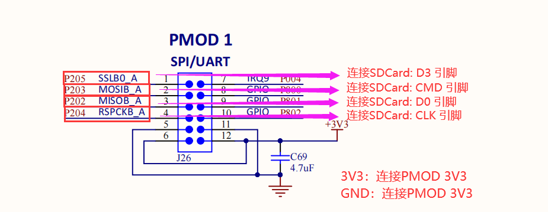
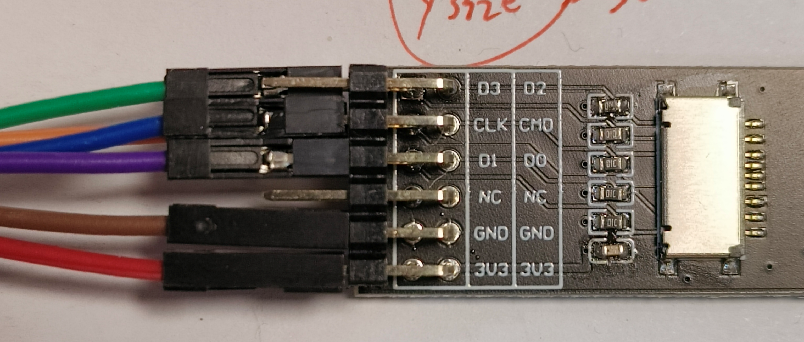
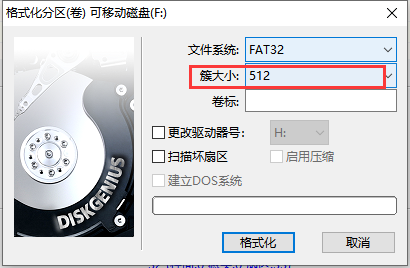
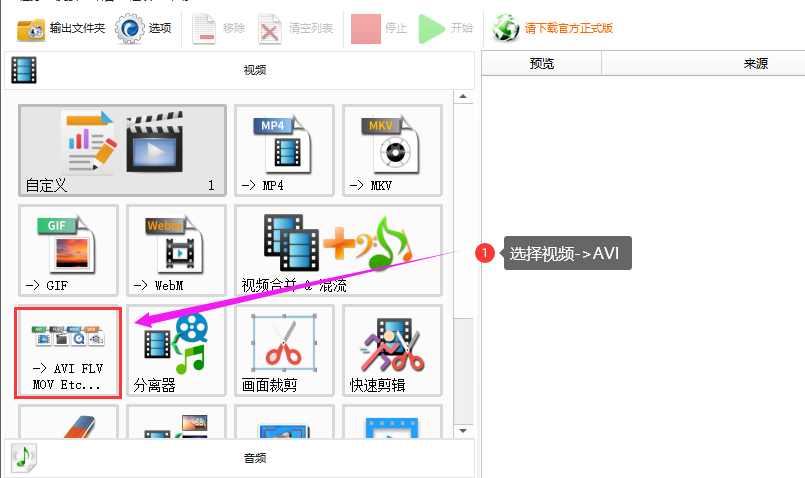
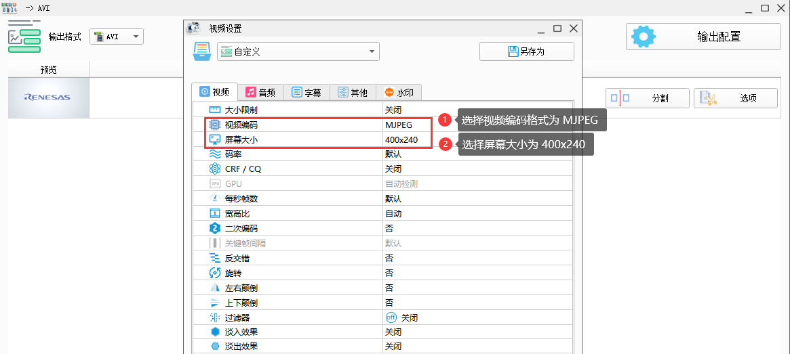
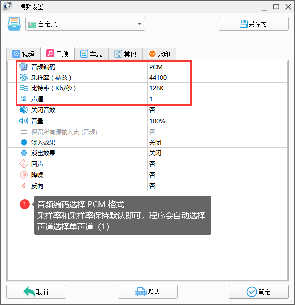
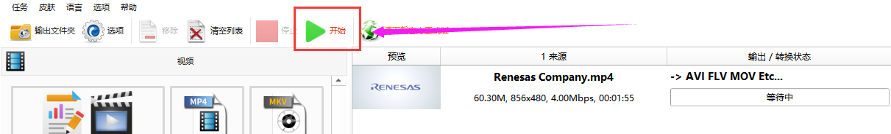
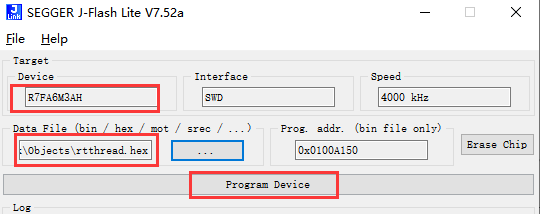

# 瑞萨 Demo 上手指南

## 软件仓库地址

RA6M3-EK 音视频播放 demo 源码：[ra6m3-video-demo](https://github.com/Rbb666/ra6m3-video-demo)

## 硬件连接方式

* EK-RA6M3 开发板 PMOD1 接口原理图与 PMOD 接口模块连接方式：

 

## SD卡格式化

这里我使用 `DiskGenius` 工具进行 SD卡格式化，值得注意的是：SD卡需要使用 512 Byte 大小格式化扇区。

## 视频制作方式

这里我使用 [格式工厂](http://down.pcgeshi.com/FormatFactory_setup.exe) 软件进行视频转码处理，具体使用方式如下：

* 视频配置选项：

* 音频配置选项：

* 配置选择好并选择指定的输出路径后，点击确定。最后点击开始转码即可完成视频转换步骤

  

* 视频转换成功后，将其后缀名为 .avi 的视频存放到 sdcard 中即可

## 音频电路硬件连接

代码中配置的音频输出引脚为 P908、P907 因此需要将这两个引脚连接至扬声器/放大器引脚上。（若使用瑞萨官方arduino音频拓展板直接连接即可）

## 固件烧录方式

* 打开 J-Flash 软件，选择目标芯片：`R7FA6M3AH` ，然后选择固件进行烧录即可

## 查看 LOG 方式

* 如需查看开发板 log 信息可使用 usb-ttl 与 EK-RA6M3 开发板的 P402（TX），P401（RX）连接

## EK-RA6M3 Demo 使用方式

1. 准备一张 8GB SDCard（>=32 GB 会出现问题），拷贝视频资源到存储卡
2. 将带有 SDCard 的 PMOD 模块插入 EK-RA6M3 的 PMOD1 接口
3. 连接 RGB 屏幕
4. 烧录固件
5. 正常运行上电屏幕上会显示该 SDCard 的文件系统信息，点击后缀名为 .avi 的文件，接着屏幕便会循环遍历播放文件系统中的视频文件
6. 使用 UI 的上下按键可以切换上/下一个视频资源，使用左侧的滑条可以调节音量大小（向上滑动+，向下滑动-）
